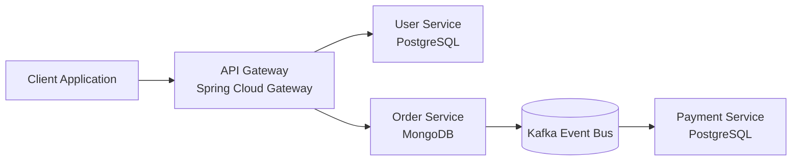

# Smart Order Microservices


A distributed microservices platform built with **Java and Spring Boot** demonstrating modern backend architecture patterns including **event-driven communication, RESTful APIs, and containerized deployment**.

This project aims to demonstrate **real-world backend engineering practices** used in scalable distributed systems.

---

# Project Status

🚧 **In Development**

This repository documents the **step-by-step construction of a distributed microservices architecture**.
Each feature is introduced through incremental commits to demonstrate engineering workflow, architectural decisions, and best practices.

---

# Architecture Overview

The system is composed of multiple microservices responsible for different business capabilities.

### Services

* **API Gateway** – Central entry point for all requests
* **User Service** – Manages user accounts
* **Order Service** – Handles order creation and management
* **Payment Service** – Processes payments asynchronously
* **Shared Library** – Common events and shared components

---

# Architecture Diagram



---

# Key Features

* Microservices architecture
* Event-driven communication using Kafka
* RESTful APIs built with Spring Boot
* API Gateway routing using Spring Cloud Gateway
* Polyglot persistence (PostgreSQL + MongoDB)
* Containerized infrastructure using Docker
* Modular **Maven multi-module architecture**
* Unit testing with **JUnit 5 and Mockito**

---

# Tech Stack

## Backend

* Java 21
* Spring Boot
* Spring Cloud Gateway
* Spring Data JPA
* Spring Data MongoDB

## Messaging

* Apache Kafka

## Databases

* PostgreSQL
* MongoDB

## Infrastructure

* Docker
* Docker Compose

## Testing

* JUnit 5
* Mockito

---

# Design Patterns Used

This project applies several common **enterprise software architecture patterns**:

* **Repository Pattern** – Data access abstraction
* **DTO Pattern** – Data transfer between layers
* **Service Layer Pattern** – Business logic encapsulation
* **Event-Driven Architecture** – Asynchronous communication
* **API Gateway Pattern** – Centralized request routing
* **Factory Pattern** – Event creation

---

# Project Structure

```
smart-order-microservices
│
├── api-gateway
│
├── user-service
│
├── order-service
│
├── payment-service
│
├── shared-lib
│
├── docker
│
└── docs
```

---

# Event Flow

1. A client sends a request through the **API Gateway**
2. The **Order Service** stores the order in MongoDB
3. The service publishes an **OrderCreatedEvent**
4. The event is sent to **Kafka**
5. The **Payment Service** consumes the event
6. Payment processing is executed asynchronously

---

# Running the Project

## Requirements

* Java 21
* Maven
* Docker
* Docker Compose

---

## Clone the Repository

```bash
git clone https://github.com/AlexanderAlves77/projetos_praticos_android_java.git
cd projetos_praticos_android_java/smart-order-microservices
```

---

## Start Infrastructure

This will start Kafka, PostgreSQL, and MongoDB containers.

```bash
docker compose up -d
```

---

## Build the Project

```bash
mvn clean install
```

---

## Run a Service

Each microservice can be started individually:

```bash
mvn spring-boot:run
```

---

# Future Improvements

Planned improvements for the architecture:

* Kubernetes deployment
* CI/CD pipeline
* Observability (Prometheus + Grafana)
* Distributed tracing
* Resilience patterns (Circuit Breaker)
* Authentication with JWT
* API documentation with OpenAPI / Swagger

---

# Documentation

Additional architecture documentation can be found in the **docs folder**.

```
docs
 ├ architecture.md
 ├ event-flow.md
 └ kafka-topology.md
```

---

# Author

**Alexander Alves**
```
Computer Science Student
Java Developer
QA Automation Engineer
Game Development Enthusiast
```